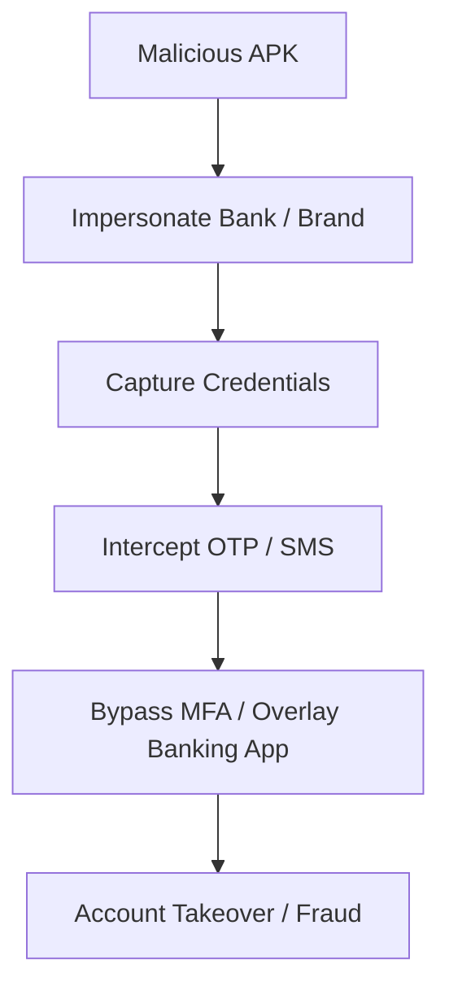

# FraudShield AI

**Generative AI-Powered Automated Malware Investigation Platform for Fraudulent Android APKs**

> **Hackathon Goal:** Turn a suspicious Android APK into a complete fraud investigation report — including IOCs, MITRE ATT&CK mapping, banking fraud impact, AI explanation, and risk score — in under 2 minutes.

FraudShield AI transforms the APKDeepLens static analyzer into an end-to-end autonomous fraud investigation platform. It is designed for banks, financial institutions, fraud teams, and SOC analysts to rapidly investigate suspicious Android APKs distributed via SMS, WhatsApp, Telegram, email, or phishing websites.

---

## Hackathon Pitch

Manual reverse engineering of a malicious APK takes **2–8 hours** of analyst time. FraudShield AI automates the entire pipeline from APK upload to an AI-generated investigation report and Security Copilot chat — **reducing it to under 2 minutes**.

Built for **banking fraud detection**, it answers the questions fraud teams actually care about:

- Can this APK steal OTPs?
- Can it capture credentials?
- Can it overlay a banking app?
- Can it bypass MFA?
- What IOCs does it communicate with?
- What is the risk score?

---

## Problem Statement

Fraudulent Android APKs are increasingly used to:

- Steal OTPs and intercept SMS
- Capture credentials and keystrokes
- Hijack banking apps via screen overlays
- Exfiltrate data to C2 servers
- Take over customer accounts and perform unauthorized transactions

Manual investigation requires expert reverse engineers, is slow, and does not scale. Banks and SOC teams need an autonomous tool that converts raw APK files into **actionable threat intelligence**.

---

## Solution Approach

FraudShield AI combines **static analysis**, **dynamic sandboxing**, **generative AI**, and **threat intelligence** into one autonomous pipeline. It focuses on **banking fraud impact**, not just generic malware detection.

For this hackathon, we built a **working MVP** that proves the full pipeline end-to-end: upload → decompile → static analysis → dynamic sandbox → AI explanation → classification → MITRE mapping → fraud impact → risk score → reports → chatbot.

---

## System Architecture

```
┌─────────────────────────────────────────────────────────────┐
│                     Streamlit Frontend                        │
│                 (Upload, Report, Copilot)                       │
└──────────────────────────┬──────────────────────────────────────┘
                           │ REST API
┌──────────────────────────▼──────────────────────────────────────┐
│                      FastAPI Backend                            │
│         /api/upload  /api/investigate  /api/chat                │
└──────────────────────────┬──────────────────────────────────────┘
                           │
┌──────────────────────────▼──────────────────────────────────────┐
│                  Analysis Orchestrator (Synchronous)            │
│          Sequences engines, persists results, generates reports │
└──────┬────────┬────────┬────────┬────────┬────────┬───────────────┘
       │        │        │        │        │        │
       ▼        ▼        ▼        ▼        ▼        ▼
┌──────────┐ ┌──────────┐ ┌──────────┐ ┌──────────┐ ┌──────────┐
│  Ingest  │ │  Reverse │ │  Static  │ │  Dynamic │ │   IOC    │
│  Engine  │ │  Engine  │ │  Engine  │ │ Sandbox  │ │ Extractor│
└────┬─────┘ └────┬─────┘ └────┬─────┘ └────┬─────┘ └────┬─────┘
     │            │            │            │            │
     ▼            ▼            ▼            ▼            ▼
┌──────────┐ ┌──────────┐ ┌──────────┐ ┌──────────┐ ┌──────────┐
│  AI      │ │  Malware │ │  MITRE   │ │  Fraud   │ │  Risk    │
│ Analyst  │ │Classifier│ │  Mapper  │ │  Impact  │ │  Engine  │
└────┬─────┘ └────┬─────┘ └────┬─────┘ └────┬─────┘ └────┬─────┘
     │            │            │            │            │
     └────────────┴────────────┴────────────┴────────────┘
                                   │
                                   ▼
                    ┌──────────────────────────┐
                    │   Report Generator       │
                    │   PDF / HTML / JSON      │
                    └────────────┬─────────────┘
                                 │
            ┌────────────────────┼────────────────────┐
            ▼                    ▼                    ▼
   ┌────────────────┐   ┌────────────────┐   ┌────────────────┐
   │  Threat Graph  │   │  Vector DB     │   │  Relational DB │
   │  (Mermaid)     │   │  (ChromaDB)    │   │  SQLite / PG   │
   └────────────────┘   └────────────────┘   └────────────────┘
            │                    │                    │
            └────────────────────┼────────────────────┘
                               ▼
                    ┌──────────────────────────┐
                    │   Security Copilot Chat  │
                    │   (Gemini + RAG)         │
                    └──────────────────────────┘
```

> **Hackathon note:** The orchestrator runs synchronously in the MVP so a single upload completes the full pipeline in one API call. Background workers and async task queues are planned for future scaling.

---

## End-to-End Investigation Workflow

```
APK Upload
    ↓
Hash + Metadata Extraction (SHA256, package, version, cert, signature)
    ↓
Reverse Engineering (JADX → Java sources + AndroidManifest.xml)
    ↓
Static Analysis Engine
    ↓
Fraud Pattern Detection (SMS, accessibility, overlay, C2, bank impersonation)
    ↓
APKDeepLens Security Checks (permissions, crypto, WebView, SSL, storage, etc.)
    ↓
IOC Extraction (URLs, IPs, domains, emails, hashes)
    ↓
Dynamic Analysis Sandbox (MobSF → ADB+Frida → ADB-only → simulated fallback)
    ↓
AI Reverse Engineering Analyst (Gemini explains behavior, threat, intent, banking impact)
    ↓
Malware Classification (Banking Trojan / Spyware / RAT / Dropper / Adware / Ransomware / Credential Stealer / Hybrid / Benign)
    ↓
MITRE ATT&CK Mobile Mapping
    ↓
Banking Fraud Impact Assessment
    ↓
Weighted Risk Scoring (0–100)
    ↓
Investigation Report Generation (PDF, HTML, JSON, Mermaid)
    ↓
Persistence to Database + Vector Store
    ↓
Security Copilot Chatbot (RAG-powered Q&A)
```

---

## Attack Chain Visualization (Mermaid)

FraudShield AI automatically generates an attack-chain graph for each APK:



Generated graphs are saved as `.mmd` files and exposed via the API at `/api/reports/mermaid`.

---

## What We Built for the Hackathon

The MVP delivers every item in the PRD Hackathon Must-Have list:

| Hackathon Requirement | Status | How it works |
|-----------------------|--------|--------------|
| APK Upload | ✅ | FastAPI endpoint validates, hashes, and stores the APK. |
| Static Analysis | ✅ | Fraud-focused rules + APKDeepLens security checks on decompiled Java/XML. |
| AI Malware Analyst | ✅ | Gemini explains functionality, threat, intent, and banking impact. |
| MITRE Mapping | ✅ | Maps fraud indicators to MITRE ATT&CK for Mobile techniques. |
| Risk Score | ✅ | Weighted 0–100 score with Safe / Suspicious / High Risk / Critical categories. |
| Fraud Assessment | ✅ | Answers OTP theft, credential capture, MFA bypass, overlay, transaction, and impersonation questions. |
| PDF Report | ✅ | Generates PDF, HTML, and JSON reports with executive and technical sections. |
| Chatbot | ✅ | RAG Security Copilot powered by ChromaDB + Gemini. |

---

## Implementation Status vs. Future Roadmap

The table below maps the PRD modules to the current codebase. Items marked **Implemented** are working in the hackathon MVP. Items marked **Partial** or **Future Plan** are documented in the PRD but not yet built or only partially built.

| PRD Module | Status | Notes |
|------------|--------|-------|
| **M1: APK Ingestion Engine** | ✅ Implemented | Validates APK, computes SHA256, extracts metadata, certificate, signature, package, version, SDK, components. |
| **M2: Reverse Engineering Engine** | ✅ Implemented | Bundled JADX decompilation with androguard fallback for AndroidManifest.xml. |
| **M3: Static Analysis Engine** | ✅ Implemented | Fraud-focused rule engine detects dangerous permissions, suspicious APIs, runtime exec, dynamic loading, WebView abuse, root/emulator detection, accessibility abuse, hardcoded URLs/IPs, secrets, banking impersonation, obfuscation. |
| **M4: AI Reverse Engineering** | ✅ Implemented | Gemini 1.5 Flash explains functionality, threat, intent, and banking impact with structured parsing and fallback. PRD target was Gemini 2.5 Pro; upgrade is a future plan. |
| **M5: Dynamic Analysis Sandbox** | ✅ Implemented (with fallback) | Supports MobSF API, ADB+Frida, ADB-only logcat, and a simulated behavioral sandbox fallback so the pipeline always completes. |
| **M6: Malware Classification Engine** | ✅ Implemented (rule-based) | Heuristic classifier produces Banking Trojan / Spyware / RAT / Dropper / Adware / Ransomware / Credential Stealer / Hybrid / Benign. ML model (XGBoost) is a future plan. |
| **M7: Threat Intelligence Engine** | ✅ Implemented | Regex-based IOC extraction + optional VirusTotal enrichment for file hash, URLs, domains, and IPs. |
| **M8: MITRE ATT&CK Mapping** | ✅ Implemented | Maps findings to MITRE ATT&CK for Mobile techniques (T1412, T1516, T1659, T1071, T1417, T1401, T1518, T1414, T1433, T1533, T1575, T1406, T1628). |
| **M9: Banking Fraud Impact Engine** | ✅ Implemented | Answers: can steal OTP, capture credentials, bypass MFA, overlay banking apps, perform transactions, impersonate bank. |
| **M10: Risk Scoring Engine** | ✅ Implemented | Weighted 0–100 score combining static, dynamic, fraud, and AI confidence components. |
| **M11: AI Investigation Report** | ✅ Implemented | Auto-generates PDF, HTML, and JSON reports with executive summary, technical/behavioral findings, classification, MITRE mapping, fraud impact, risk score, IOCs, and recommendations. Uses xhtml2pdf; ReportLab migration is a future plan. |
| **M12: Security Copilot Chatbot** | ✅ Implemented (RAG) | ChromaDB + Gemini RAG chatbot. Uses ChromaDB directly; LangChain integration is a future plan. |
| **M13: Threat Graph Visualizer** | ✅ Implemented | Generates Mermaid attack-chain graphs from fraud impact indicators. |
| **Database Architecture** | ✅ Implemented | SQLAlchemy models with SQLite default; PostgreSQL-compatible via `DATABASE_URL`. |
| **Vector Database** | ✅ Implemented | ChromaDB stores investigation chunks for retrieval. |
| **FastAPI Backend** | ✅ Implemented | REST API for upload, investigate, reports, dynamic analysis, and chat. |
| **Streamlit Frontend** | ✅ Implemented | Web UI for upload, investigation report, and Security Copilot. |
| **Gemini 2.5 Pro** | 🔄 Future Plan | PRD specifies Gemini 2.5 Pro; MVP uses Gemini 1.5 Flash for speed and availability. |
| **ReportLab PDF Generation** | 🔄 Future Plan | PRD specifies ReportLab; current PDF generation uses xhtml2pdf. |
| **APKTool Integration** | 🔄 Future Plan | PRD mentions APKTool; current engine uses JADX + androguard. |
| **Celery / Background Workers** | 🔄 Future Plan | PRD mentions Celery workers; current orchestrator is synchronous. |
| **Docker / Docker Compose** | 🔄 Partial / Future Plan | A basic `Dockerfile` exists but is configured for the legacy CLI, not the full FastAPI + Streamlit stack. Production containerization is a future plan. |
| **YARA Rules Integration** | 🔄 Future Plan | PRD mentions YARA rules; current engine uses regex and existing APKDeepLens scanners. |
| **Behavior Correlation Engine** | 🔄 Future Plan | PRD lists a dedicated correlation engine between static and dynamic behavior; currently correlated inside the orchestrator. |
| **ML-Based Malware Classification** | 🔄 Future Plan | PRD proposed XGBoost / Gradient Boosting; current implementation is heuristic/rule-based. |
| **Containerized Dynamic Sandbox** | 🔄 Future Plan | PRD mentions containerized Android sandbox; current implementation uses external MobSF/ADB/Frida. |
| **Multi-APK Batch Analysis** | 🔄 Future Plan | Analyze and compare multiple APKs simultaneously. |
| **Zero-Day Detection** | 🔄 Future Plan | Anomaly-based detection for unknown malware families. |
| **Federated Threat Intelligence** | 🔄 Future Plan | Share IOCs across organizations without central data sharing. |
| **APK Similarity Search** | 🔄 Future Plan | Semantic/code similarity search for malware family clustering. |
| **Malware Family Clustering** | 🔄 Future Plan | Cluster samples into families using embeddings and graph analysis. |
| **SOC Dashboard** | 🔄 Future Plan | Centralized analyst dashboard with investigation history, trends, and alerts. |
| **SIEM Integration** | 🔄 Future Plan | Webhook/API export to Splunk, QRadar, Sentinel, etc. |
| **Autonomous Threat Hunting** | 🔄 Future Plan | Proactive hunting across APK feeds and app stores. |
| **Threat Feed Sharing** | 🔄 Future Plan | Export IOC feeds for firewalls, DNS, and SIEM watchlists. |
| **Enterprise Deployment** | 🔄 Future Plan | RBAC, SSO, audit logging, and multi-tenant deployment. |
| **Automated Test Suite** | 🔄 Future Plan | No unit/integration tests yet. |

---

## Tech Stack

| Layer | Technology | Hackathon Choice |
|-------|------------|------------------|
| Frontend | Streamlit | Fast UI for demos. |
| Backend | FastAPI | Lightweight, async-ready REST API. |
| Reverse Engineering | JADX, Androguard | JADX for Java sources; androguard for manifest fallback. |
| Static Analysis | Python rule engine, Androguard, APKDeepLens scanners | Reused APKDeepLens scanners + added fraud-specific rules. |
| AI | Google Gemini 1.5 Flash | Chosen for speed and availability; upgrade to 2.5 Pro planned. |
| Dynamic Sandbox | MobSF, ADB, Frida, simulated fallback | External tools with robust fallback so demo never breaks. |
| Threat Intelligence | VirusTotal API v3 (optional) | Enriches IOCs when configured. |
| Database | SQLAlchemy + SQLite (PostgreSQL-ready) | SQLite for zero-config hackathon setup; PostgreSQL via `DATABASE_URL`. |
| Vector Store | ChromaDB + sentence-transformers | `all-MiniLM-L6-v2` embeddings for RAG. |
| Reports | xhtml2pdf (PDF), Jinja-like HTML, JSON | xhtml2pdf chosen over ReportLab for simpler HTML-to-PDF flow. |
| Visualization | Mermaid | Attack-chain diagrams render anywhere. |

---

## Quick Start

### 1. Install dependencies

```bash
python -m venv venv
# Windows
.\venv\Scripts\activate
# Linux/macOS
source venv/bin/activate
pip install -r requirements.txt
```

### 2. Configure environment

```bash
cp .env.example .env
# Edit .env and add your GEMINI_API_KEY (optional but recommended)
# Set FRAUDSHIELD_API_KEY to require API authentication
# Set ENABLE_VIRUSTOTAL=true and VIRUSTOTAL_API_KEY for threat enrichment
# Set ENABLE_DYNAMIC_ANALYSIS=true for live sandbox analysis
```

### 3. Start the backend

```bash
uvicorn api.main:app --reload
```

### 4. Start the frontend (in another terminal)

```bash
streamlit run frontend/app.py
```

Open [http://localhost:8501](http://localhost:8501) in your browser.

---

## Legacy CLI

The original APKDeepLens CLI remains available:

```bash
python APKDeepLens.py -apk testing_apps/smartplug.apk -report json
```

---

## Core Modules

| Module | File | Description | Status |
|--------|------|-------------|--------|
| APK Ingestion | `core/ingestion.py` | Validate, hash, and extract APK metadata | ✅ |
| Reverse Engineering | `core/reverse_engineering.py` | Decompile APK with bundled JADX | ✅ |
| Static Analysis | `core/static_analysis.py` | Fraud-focused static analysis | ✅ |
| Dynamic Analysis | `core/dynamic_analysis.py` | MobSF / Frida / ADB / simulated sandbox | ✅ |
| IOC Extraction | `core/ioc_extractor.py` | Extract URLs, IPs, domains, emails, hashes | ✅ |
| VirusTotal | `core/virus_total.py` | Enrich IOCs with VT reputation | ✅ |
| MITRE Mapping | `core/mitre_mapper.py` | Map behaviors to MITRE ATT&CK | ✅ |
| Fraud Impact | `core/fraud_impact.py` | Banking fraud impact assessment | ✅ |
| Risk Scoring | `core/risk_scoring.py` | Weighted 0-100 risk score | ✅ |
| Malware Classification | `core/malware_classifier.py` | Classify malware family | ✅ |
| AI Analyst | `core/ai_analyst.py` | Gemini-powered reverse engineering summary | ✅ |
| Report Generator | `core/report_generator.py` | PDF/HTML/JSON reports | ✅ |
| Threat Graph | `core/threat_graph.py` | Mermaid attack-chain graph | ✅ |
| Orchestrator | `core/orchestrator.py` | End-to-end workflow | ✅ |
| API | `api/main.py` | FastAPI backend | ✅ |
| Frontend | `frontend/app.py` | Streamlit UI | ✅ |
| Chatbot | `chat/copilot.py` | RAG Security Copilot | ✅ |
| Database | `db/models.py` | SQLAlchemy models (SQLite default, PostgreSQL ready) | ✅ |
| Vector DB | `db/vector_store.py` | ChromaDB retrieval store | ✅ |

---

## API Endpoints

| Method | Endpoint | Description |
|--------|----------|-------------|
| GET | `/` | Health check |
| POST | `/api/upload` | Upload APK file |
| POST | `/api/investigate` | Run full investigation |
| POST | `/api/dynamic_analysis` | Run dynamic analysis sandbox |
| GET | `/api/reports/{json\|pdf\|html\|mermaid}` | Download report |
| POST | `/api/chat` | Ask the Security Copilot |

---

## Key Files Added / Transformed

- `FraudShield_AI_PRD (1).md` / `prd.md` — Product Requirements Document
- `config.py` — Central configuration
- `api/main.py` — FastAPI backend
- `frontend/app.py` — Streamlit frontend
- `core/` — New analysis engines
- `db/` — Database and vector store models
- `chat/` — Security Copilot chatbot
- `requirements.txt` — Updated dependencies
- `.env.example` — Environment template
- `Dockerfile` — Basic container (legacy CLI only; full stack containerization is future work)

---

## Hackathon Demo Flow

1. **Upload** a suspicious APK through the Streamlit UI.
2. **Investigate** to run the full pipeline.
3. **View** risk score, classification, fraud impact, and AI summary.
4. **Download** PDF/JSON/HTML investigation reports.
5. **Visualize** the Mermaid attack-chain graph.
6. **Chat** with the Security Copilot to ask natural-language questions about the APK.

---

## Future Roadmap

The following capabilities are planned beyond the hackathon MVP:

- **Gemini 2.5 Pro upgrade** — deeper reasoning and more accurate malware classification.
- **ML-Based Malware Classifier** — train XGBoost/Gradient Boosting on labeled samples.
- **YARA Rules** — integrate signature-based detection.
- **Celery / Background Workers** — async, scalable investigation pipeline.
- **Production Docker / Docker Compose** — containerized FastAPI + Streamlit + optional PostgreSQL + ChromaDB.
- **APKTool Integration** — richer resource/asset extraction alongside JADX.
- **ReportLab PDF Generation** — alternative PDF backend.
- **Containerized Android Sandbox** — fully isolated dynamic analysis environment.
- **Multi-APK Batch Analysis** — analyze multiple samples and compare findings.
- **Zero-Day Detection** — anomaly detection for unknown threats.
- **Federated Threat Intelligence** — privacy-preserving IOC sharing.
- **APK Similarity & Malware Family Clustering** — embedding-based clustering.
- **SOC Dashboard** — multi-investigation view with trends and alerting.
- **SIEM Integration** — export to Splunk, QRadar, Microsoft Sentinel.
- **Autonomous Threat Hunting** — proactive APK feed monitoring.
- **Threat Feed Sharing** — automated IOC export for firewalls and DNS filters.
- **Enterprise Deployment** — RBAC, SSO, audit logs, and multi-tenancy.
- **Automated Test Suite** — unit and integration tests for core engines.

---

## Troubleshooting

### JADX does not create output

The bundled JADX requires a compatible Java installation. If you see `INFO - loading ...` with no output, try upgrading Java to 11 or newer and ensure `JAVA_HOME` is set. If JADX still fails, FraudShield AI falls back to androguard to extract the manifest so the pipeline can continue.

### ChromaDB / sentence-transformers import error

The RAG chatbot uses ChromaDB and sentence-transformers. If the local environment has a broken or incompatible PyTorch installation, the chatbot will still answer using the Gemini model and available context, but vector retrieval may be disabled. For full RAG support, ensure `torch` and `sentence-transformers` are installed correctly for your Python version.

### Dynamic Analysis Sandbox

Set `ENABLE_DYNAMIC_ANALYSIS=true` to enable live sandbox analysis. The sandbox tries (in order):

1. MobSF dynamic analysis API (`MOBSF_URL`, `MOBSF_API_KEY`)
2. ADB + Frida on a connected emulator/device (`ADB_PATH`, `FRIDA_SERVER_PATH`)
3. ADB-only logcat collection
4. Simulated behavioral sandbox fallback based on static indicators

When no live tools are available, the fallback produces simulated dynamic findings so the pipeline always completes. Simulated findings are clearly labeled `[SIMULATED]` in reports and UI.

### False positives

The fraud detection rules use conservative regexes to reduce false positives. Banking brand impersonation requires explicit bank/payment brand names, C2 detection focuses on raw sockets and hardcoded IPs, and the IP regex excludes version strings. If you still see false positives, review the rules in `core/static_analysis.py` and `core/ioc_extractor.py`.

### Security hardening

The API supports optional `FRAUDSHIELD_API_KEY` authentication, upload size limits (`MAX_UPLOAD_SIZE_MB`), and rate limiting (`RATE_LIMIT_ENABLED`). Set these in `.env` for production deployments.

---

## License

See [LICENSE](LICENSE).

---

## Product Requirements

See [FraudShield_AI_PRD (1).md](FraudShield_AI_PRD%20(1).md) for the full Product Requirements Document.
